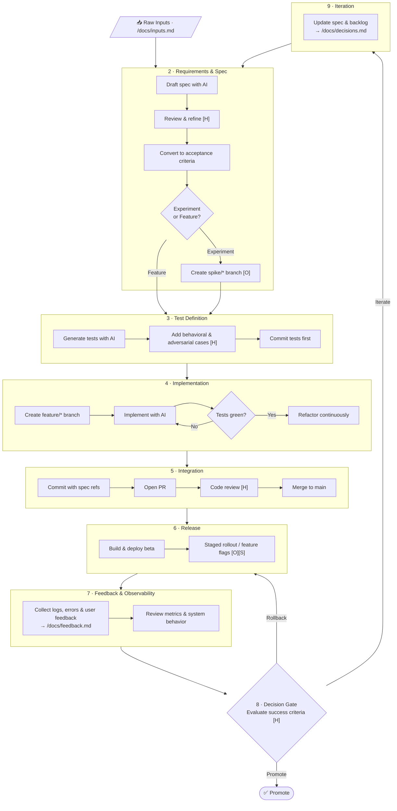

```mermaid
flowchart TD
    IN[/"📥 Raw Inputs · /docs/inputs.md"/]

    subgraph SPEC["2 · Requirements & Spec"]
        S1[Draft spec with AI] --> S2["Review & refine [H]"]
        S2 --> S3[Convert to acceptance criteria]
        S3 --> S4{Experiment\nor Feature?}
        S4 -->|Experiment| S5["Create spike/* branch [O]"]
    end

    subgraph TEST["3 · Test Definition"]
        T1[Generate tests with AI] --> T2["Add behavioral & adversarial cases [H]"]
        T2 --> T3[Commit tests first]
    end

    subgraph IMPL["4 · Implementation"]
        I1["Create feature/* branch"] --> I2[Implement with AI]
        I2 --> I3{Tests green?}
        I3 -->|No| I2
        I3 -->|Yes| I4[Refactor continuously]
    end

    subgraph INT["5 · Integration"]
        G1[Commit with spec refs] --> G2[Open PR]
        G2 --> G3["Code review [H]"]
        G3 --> G4[Merge to main]
    end

    subgraph REL["6 · Release"]
        R1[Build & deploy beta] --> R2["Staged rollout / feature flags [O][S]"]
    end

    subgraph OBS["7 · Feedback & Observability"]
        O1["Collect logs, errors & user feedback\n→ /docs/feedback.md"] --> O2[Review metrics & system behavior]
    end

    DG{"8 · Decision Gate\nEvaluate success criteria [H]"}

    subgraph ITER["9 · Iteration"]
        IT1["Update spec & backlog\n→ /docs/decisions.md"]
    end

    DONE(["✅ Promote"])

    IN --> SPEC
    S4 -->|Feature| TEST
    S5 --> TEST
    TEST --> IMPL
    IMPL --> INT
    INT --> REL
    REL --> OBS
    OBS --> DG
    DG -->|Promote| DONE
    DG -->|Rollback| REL
    DG -->|Iterate| ITER
    ITER --> SPEC
```

**Legend:** `[H]` Human required · `[O]` Optional · `[S]` Scale-related
