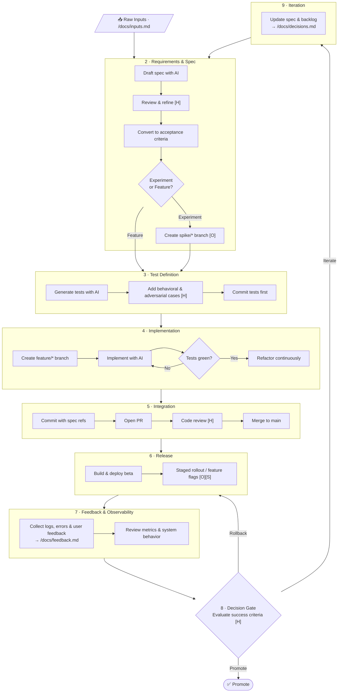

# Development Process

{: .no_toc }

CareerAid is built using an AI-native development loop — a structured workflow that integrates LLM assistance at each phase while keeping human judgment at the decision gates that matter.

  
Contents

  {: .text-delta }
- TOC
{:toc}

---

## Flowchart

**Legend:** `[H]` Human required · `[O]` Optional · `[S]` Scale-related

---

## Loop Steps

### 1. Input Collection

Capture raw inputs (notes, user feedback, ideas) into `/docs/inputs.md`.

### 2. Requirements & Spec

1. Draft requirements/spec in `/docs/spec.md` using AI assistance.
2. **[H]** Review and refine spec for clarity, scope, and testability.
3. Convert requirements into explicit, testable acceptance criteria within the spec.
4. Classify items (validated / hypothesis / speculative) and decide: experiment vs full feature.
5. **[O]** Create a `spike/*` branch for low-confidence experiments.

### 3. Test Definition

1. Generate initial test cases via AI into `/tests/*`.
2. **[H]** Review tests and add behavioral and adversarial cases.
3. Commit tests first — they establish the baseline contract.

### 4. Implementation

1. Create a `feature/*` branch.
2. Implement using AI assistance (editor chat/autocomplete).
3. Ensure all tests pass with a minimal diff and adherence to the style guide.
4. Run tests locally until green; refactor continuously while keeping tests passing.

### 5. Integration

1. Commit changes with references to spec sections.
2. Open a pull request.
3. **[H]** Conduct code review (optionally AI-assisted).
4. Merge to main when tests and review pass.

### 6. Release

1. Build and release an experimental beta.
2. **[O][S]** Use staged rollout or feature flags if available.

### 7. Feedback & Observability

1. Collect logs, errors, and user feedback into `/docs/feedback.md`.
2. Review basic metrics and system behavior.

### 8. Decision Gate

**[H]** Evaluate against predefined success criteria. Decide: **promote** / **rollback** / **iterate**. Record decision in `/docs/decisions.md`.

### 9. Iteration

Update `/docs/spec.md` and the backlog based on feedback, then repeat from Step 2.

---

## Supporting Files

| File | Purpose |
|---|---|
| `/docs/spec.md` | Requirements + acceptance criteria (source of truth) |
| `/docs/inputs.md` | Raw inputs |
| `/docs/feedback.md` | Real-world observations |
| `/docs/decisions.md` | Iteration memory |
| `/tests/` | Validation contract |
| `CONTRIBUTING.md` | Style guide + constraints |

---

## Always-On Constraints

- Maintain basic data/schema discipline (migrations, compatibility)
- Follow security hygiene (secrets, dependencies, access control)
- Monitor basic performance and cost (latency, API usage)
